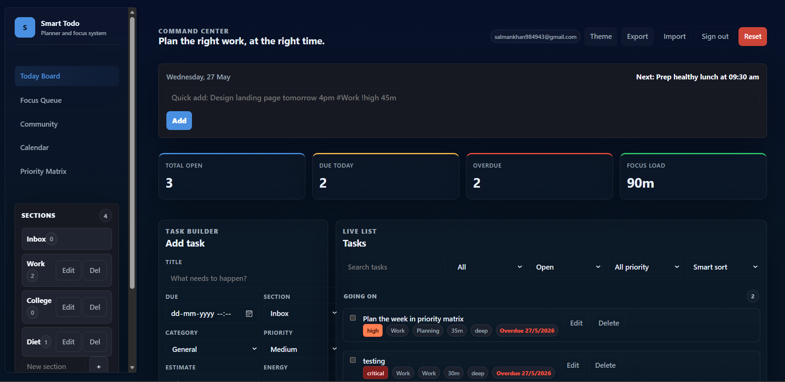
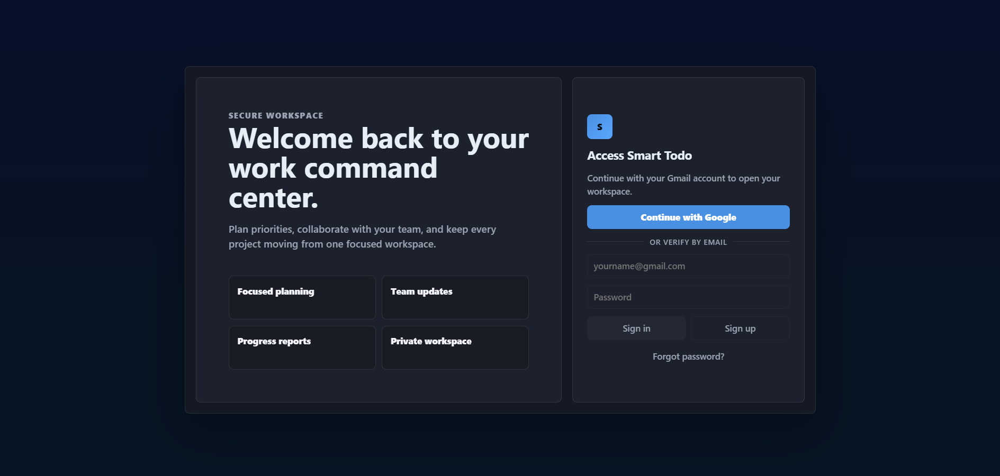
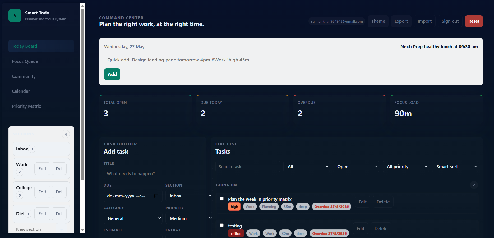
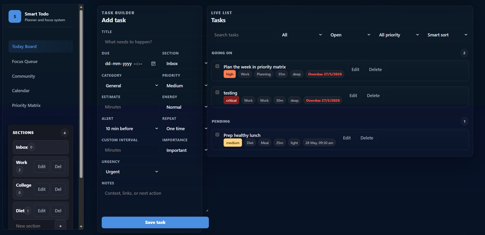
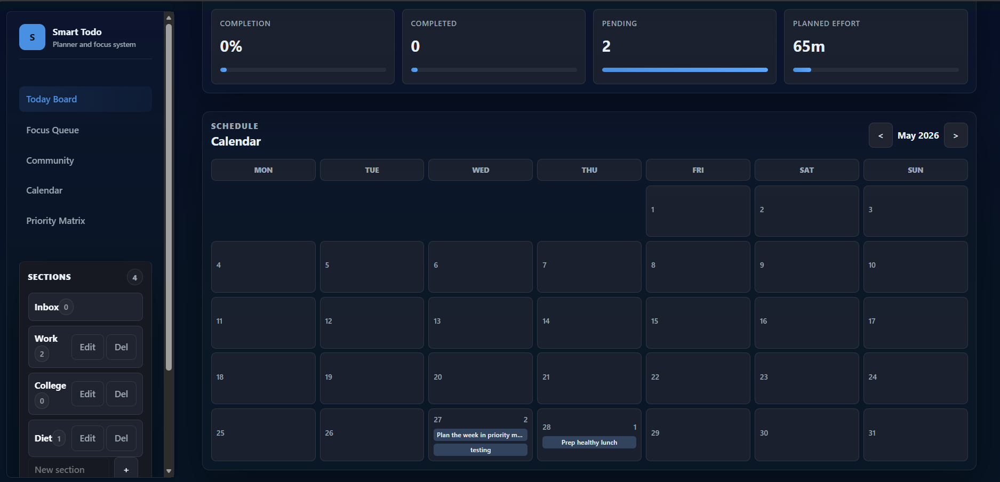
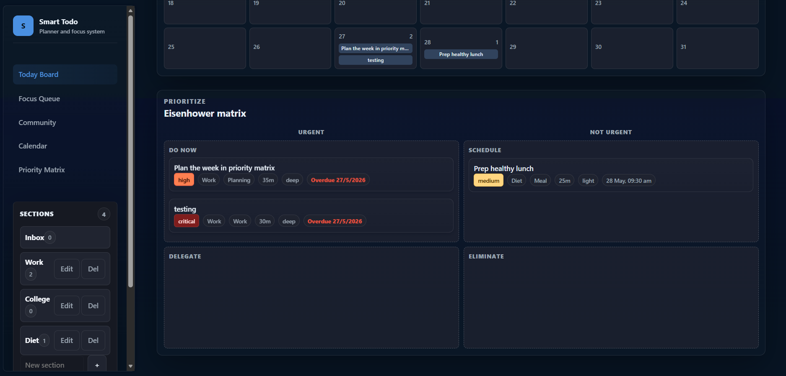

# 🚀 Smart Todo — Enterprise Productivity & Task Management Platform

<p align="center">
  
</p>

<h1 align="center">Smart Todo</h1>

<p align="center">
  <strong>Modern • Intelligent • Enterprise Productivity Platform</strong>
</p>

<p align="center">
  Smart Todo is a premium productivity and task management platform inspired by Todoist, TickTick, Linear, and Notion.  
  It combines intelligent task scheduling, real-time synchronization, Gmail reminder automation, productivity workflows, and a modern enterprise-grade UI experience.
</p>

---

<p align="center">

  
  
  
  
  

</p>

---

# ✨ Features

## 📋 Advanced Task Management

- ✅ Create, edit, update, and delete tasks
- ✅ Task due date & time scheduling
- ✅ Priority management system
  - Low
  - Medium
  - High
  - Critical
- ✅ Task descriptions & notes
- ✅ Mark tasks as completed
- ✅ Real-time Firestore synchronization
- ✅ Structured productivity workflow

---

## 🧠 Productivity Features

- 📌 Eisenhower Matrix support
- 📅 Calendar-based task planning
- 📂 Pending / Ongoing / Completed sections
- ⚡ Smart productivity workflows
- 📊 Daily task organization
- 🧩 Focus-driven task categorization

---

## 🎨 Modern Enterprise UI

- 🌙 Dark mode & ☀️ Light mode
- 📱 Fully responsive layout
- 🪟 Glassmorphism-inspired design
- 📌 Collapsible sidebar navigation
- ✨ Smooth transitions & animations
- 💎 Premium enterprise-grade UI
- 📲 Mobile-friendly experience

---

## 🔔 Automated Gmail Reminder System

- 📧 Scheduled task reminder emails
- ⏰ Deadline & pre-alert notifications
- 🔁 Automated reminder scheduler
- 📮 Gmail SMTP integration using Nodemailer
- ⚡ Lightweight serverless notification system

---

## ☁️ Backend & Cloud Features

- 🔥 Firebase Firestore integration
- 🔄 Real-time task synchronization
- 🚀 Vercel deployment support
- 🤖 GitHub Actions automation
- 🧠 Optimized Firestore queries & indexing

---

# 🖼️ Screenshots

---

## 🔐 Login Page

<p align="center">
  
</p>

---

## ☀️ Dashboard — Light Mode

<p align="center">
  
</p>

---

## 🌙 Dashboard — Dark Mode

<p align="center">
  
</p>

---

## ➕ Add Task Interface

<p align="center">
  
</p>

---

## 📅 Calendar View

<p align="center">
  
</p>

---

## ⚡ Eisenhower Matrix

<p align="center">
  
</p>

---

# 🛠️ Tech Stack

| Category | Technology |
|----------|-------------|
| Frontend | HTML5, CSS3, Vanilla JavaScript |
| Backend | Node.js |
| Database | Firebase Firestore |
| Authentication | Firebase Authentication |
| Email Service | Nodemailer + Gmail SMTP |
| Deployment | Vercel |
| Automation | GitHub Actions |
| Styling | Custom CSS + Glassmorphism UI |

---

# 📁 Project Structure

```bash
smart-task-manager/
│
├── api/                         # Vercel serverless API routes
├── backend/                     # Reminder scheduler scripts
├── css/                         # Styling files
├── html/                        # Frontend pages
├── js/                          # Frontend JavaScript
├── screenshots/                 # Application screenshots
├── .github/workflows/           # GitHub Actions workflows
├── firestore.indexes.json
├── firebase.json
├── package.json
├── vercel.json
└── README.md
```

---

# ⚙️ Installation

## 1️⃣ Clone Repository

```bash
git clone https://github.com/your-username/smart-task-manager.git
cd smart-task-manager
```

---

## 2️⃣ Install Dependencies

```bash
npm install
```

---

## 3️⃣ Configure Firebase

Create a Firebase project and enable the following services:

- Firebase Authentication
- Google Sign-In
- Email/Password Authentication
- Firestore Database

---

## 4️⃣ Configure Firebase SDK

Update your Firebase configuration file:

```javascript
// js/firebase-config.js

const firebaseConfig = {
  apiKey: "YOUR_API_KEY",
  authDomain: "YOUR_AUTH_DOMAIN",
  projectId: "YOUR_PROJECT_ID",
  storageBucket: "YOUR_STORAGE_BUCKET",
  messagingSenderId: "YOUR_MESSAGING_SENDER_ID",
  appId: "YOUR_APP_ID"
};

firebase.initializeApp(firebaseConfig);
```

---

# 🔐 Environment Variables

Create a `.env` file in the root directory.

## Required Variables

| Variable | Description |
|----------|-------------|
| `GMAIL_USER` | Gmail address used for reminders |
| `GMAIL_APP_PASSWORD` | Gmail App Password |
| `MAIL_FROM` | Sender email address |
| `SCHEDULER_TOKEN` | Secure scheduler authentication token |
| `FIREBASE_SERVICE_ACCOUNT` | Firebase Admin SDK credentials |

---

## Example `.env`

```env
GMAIL_USER=your-email@gmail.com
GMAIL_APP_PASSWORD=your-app-password
MAIL_FROM=your-email@gmail.com
SCHEDULER_TOKEN=your-secret-token

FIREBASE_SERVICE_ACCOUNT={
  "type": "service_account",
  "project_id": "your-project-id"
}
```

---

# 🚀 Deployment

## Deploy to Vercel

### Step 1 — Import Repository

Import your GitHub repository into Vercel.

---

### Step 2 — Configure Environment Variables

Navigate to:

```bash
Vercel Dashboard → Project Settings → Environment Variables
```

Add all required environment variables.

---

### Step 3 — Deploy Project

Deploy using Vercel CLI:

```bash
vercel
```

Or deploy directly from the Vercel Dashboard.

---

# ⏰ Scheduler Setup

Smart Todo uses automated cron jobs for reminder emails.

## Create Vercel Cron Job

| Setting | Value |
|----------|-------|
| Schedule | `* * * * *` |
| Endpoint | `/api/send-reminders` |
| Method | `POST` |

---

## Required Header

```http
x-scheduler-token: YOUR_SCHEDULER_TOKEN
```

---

## What the Scheduler Does

- Reads scheduled tasks from Firestore
- Detects upcoming reminders
- Sends Gmail notifications automatically
- Prevents duplicate reminder emails
- Runs every minute

---

# 📧 Gmail Reminder System

The email reminder system includes:

- 📌 Due-date notifications
- ⏰ Pre-deadline alerts
- 📤 Automated email delivery
- 🔒 Secure Gmail SMTP authentication
- ⚡ Serverless email scheduling
- 🔄 Duplicate email prevention

---

# 🔥 Firestore Indexes

Deploy Firestore indexes:

```bash
firebase deploy --only firestore:indexes
```

Index configuration file:

```bash
firestore.indexes.json
```

---

# 🧪 API Testing

## Test Email Endpoint

```bash
curl -X POST "https://your-deployment.vercel.app/api/test-email?to=you@example.com&token=YOUR_SCHEDULER_TOKEN"
```

---

## Test Reminder Scheduler

```bash
curl -X POST "https://your-deployment.vercel.app/api/send-reminders" \
-H "x-scheduler-token: YOUR_SCHEDULER_TOKEN"
```

---

# 🖥️ Local Development

## Run Development Server

```bash
npm run dev
```

---

## Run Frontend with Live Server

Open:

```bash
html/main1.html
```

Using VS Code Live Server extension.

---

# 📊 Current Project Status

| Module | Status |
|--------|--------|
| Authentication | ✅ Completed |
| Dashboard UI | ✅ Completed |
| Task Management | ✅ Completed |
| Gmail Notifications | ✅ Completed |
| Reminder Scheduler | ✅ Completed |
| Calendar View | ✅ Completed |
| Eisenhower Matrix | ✅ Completed |
| Dark/Light Theme | ✅ Completed |

---

# 🚀 Future Improvements

- 🤖 AI productivity suggestions
- 👥 Team collaboration system
- 📈 Advanced analytics dashboard
- 📶 Offline support
- 📱 Progressive Web App (PWA)
- 📅 Google Calendar integrations
- 🧠 Smart recurring tasks
- 🖱️ Drag-and-drop workflow system
- 🔍 Advanced search & filtering
- 📊 Productivity heatmaps

---

# 🔒 Security Best Practices

- Never expose Firebase Admin credentials publicly
- Store all secrets using Vercel Environment Variables
- Use App Passwords instead of Gmail account passwords
- Secure API routes with scheduler tokens
- Restrict Firestore security rules properly

---

# ⚡ Performance Optimizations

- Optimized Firestore queries
- Lazy-loaded UI components
- Efficient DOM updates
- Lightweight serverless APIs
- Reduced email scheduling overhead

---

# 🤝 Contributing

Contributions are welcome.

## Steps to Contribute

1. Fork the repository
2. Create a new feature branch

```bash
git checkout -b feature/your-feature-name
```

3. Commit your changes

```bash
git commit -m "Add new feature"
```

4. Push to GitHub

```bash
git push origin feature/your-feature-name
```

5. Open a Pull Request

---

# 👨‍💻 Author

## Ibrahim Ahmed Qureshi

- 💼 Full Stack Developer
- 🚀 Productivity System Builder
- 🔥 Firebase & Modern Web Enthusiast

---

# 📜 License

This project is licensed under the MIT License.

You are free to use, modify, and distribute this project for:

- Educational purposes
- Portfolio projects
- Personal productivity systems

---

# ⭐ Support

If you like this project:

- ⭐ Star the repository
- 🍴 Fork the project
- 🐛 Report issues
- 💡 Suggest improvements

---

# 📬 Contact

## GitHub

```bash
https://github.com/your-github-username
```

## Email

```bash
your-email@gmail.com
```

---

# 💡 Inspiration

Inspired by modern productivity platforms:

- Todoist
- TickTick
- Notion
- Trello
- Linear

---

# 🏆 Project Vision

Smart Todo aims to deliver a modern productivity ecosystem that combines:

- 🎨 Premium UI/UX
- 🧠 Smart productivity workflows
- ⚡ Real-time synchronization
- 🔔 Intelligent reminder systems
- ☁️ Cloud-powered architecture
- 🚀 Enterprise-level performance

into a single powerful productivity platform.

---

<p align="center">
  <strong>🚀 Smart Todo — Build Productivity Smarter</strong>
</p>
